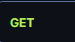

API Eurocopa 2024:

Este proyecto tiene como único proposito el aprendizaje, ya que busca poner en práctica 
los conocimientos adquiridos durante mis prácticas.  Además, me he dedicado a investigar y 
añadir nuevas funcionalidades que desconocía.

El proyecto es una API de la Eurocopa 2024 donde con diferentes llamadas podremos acceder
a los datos más relevantes de jugadores y  equipos participantes.

El proyecto consiste en una API sobre la Eurocopa 2024, que permite acceder a la información 
más relevante de los jugadores y equipos participantes a través de diversas consultas.

Todo los datos han sido obtenidos  de la página oficial de la Eurocopa 2024 https://www.uefa.com/euro2024/teams/.

Version 1.0.0:

/********************* Players *********************/

 https://euro2024-naqw.onrender.com/v1/player?pageNo=1&pageSize=10

Call for all the players

 https://euro2024-naqw.onrender.com/v1/player/id/{id}

Call  the player by ID.

 https://euro2024-naqw.onrender.com/v1/player/name?name

Call  the player by Name.

 https://euro2024-naqw.onrender.com/v1/player/goal?number

Call  the player by Goal.

 https://euro2024-naqw.onrender.com/v1/player/yellowcard?number

Call  the player by Yellow cards.

 https://euro2024-naqw.onrender.com/v1/player/redcard?number

Call  the player by Red card.

 https://euro2024-naqw.onrender.com/v1/player/save?number

Call  the player by Goalkeeper saves

 https://euro2024-naqw.onrender.com/v1/player/assist?number

Call  the player by Assist.

 https://euro2024-naqw.onrender.com/v1/player/recover?number

Call  the player by Ball Recover .

 https://euro2024-naqw.onrender.com/v1/player/dorsal?number

Call  the player by Dorsal .

 https://euro2024-naqw.onrender.com/v1/player/minute?number

Call  the player by Minutes .

 https://euro2024-naqw.onrender.com/v1/player/match?number

Call  the player by Matches .

 https://euro2024-naqw.onrender.com/v1/player/position?position

Call  the player by Position("Portero","Defensa","Mediocampistam,"Delantero") .

 https://euro2024-naqw.onrender.com/v1/player/team/{teamId}

Call  the player by Team Id .

Call all the players by properties order by descendant .

 https://euro2024-naqw.onrender.com/v1/player/goals

 https://euro2024-naqw.onrender.com/v1/player/yellowcards

 https://euro2024-naqw.onrender.com/v1/player/redcards

 https://euro2024-naqw.onrender.com/v1/player/saves

 https://euro2024-naqw.onrender.com/v1/player/assists

 https://euro2024-naqw.onrender.com/v1/player/recovered

 https://euro2024-naqw.onrender.com/v1/player/dorsals

 https://euro2024-naqw.onrender.com/v1/player/minutes

 https://euro2024-naqw.onrender.com/v1/player/matches

/********************* Teams *********************/

 https://euro2024-naqw.onrender.com/v1/team?pageNo=1&pageSize=10

Call for all the teams

 https://euro2024-naqw.onrender.com/v1/team/id/{id}

Call  the team by ID.

 https://euro2024-naqw.onrender.com/v1/team/country?country

Call  the team by Country.

 https://euro2024-naqw.onrender.com/v1/team/coach?coach

Call  the team by Coach.

 https://euro2024-naqw.onrender.com/v1/team/federation?federation

Call  the team by Federation.

 https://euro2024-naqw.onrender.com/v1/team/foundation?foundation

Call  the team by Foundation.

 https://euro2024-naqw.onrender.com/v1/team/championships?championships

Call  the team by Championships.

 https://euro2024-naqw.onrender.com/v1/team/{country}/championships

 https://euro2024-naqw.onrender.com/v1/team/{country}/coach

 https://euro2024-naqw.onrender.com/v1/team/{country}/federation

Call the properties by country

