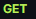

API Eurocopa 2024:

Este proyecto tiene como único proposito el aprendizaje, ya que busca poner en práctica 
los conocimientos adquiridos durante mis prácticas.  Además, me he dedicado a investigar y 
añadir nuevas funcionalidades que desconocía.

El proyecto es una API de la Eurocopa 2024 donde con diferentes llamadas podremos acceder
a los datos más relevantes de jugadores y  equipos participantes.

El proyecto consiste en una API sobre la Eurocopa 2024, que permite acceder a la información 
más relevante de los jugadores y equipos participantes a través de diversas consultas.

Todo los datos han sido obtenidos  de la página oficial de la Eurocopa 2024 https://www.uefa.com/euro2024/teams/.

Version 1.0.0:

LLamadas Get:

Llamada para todos los jugadores:
https://euro2024-naqw.onrender.com/v1/player?pageNo=1&pageSize=10